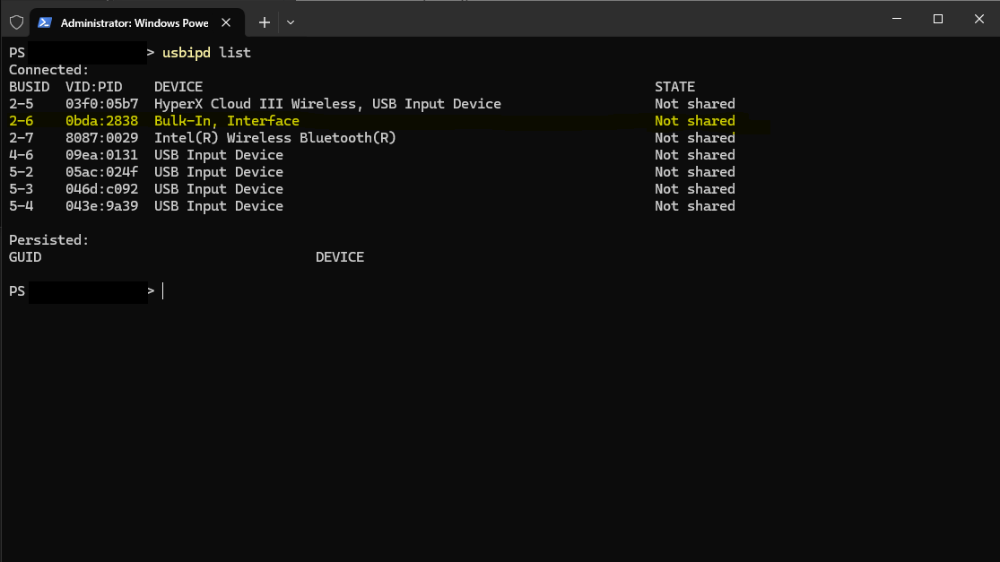
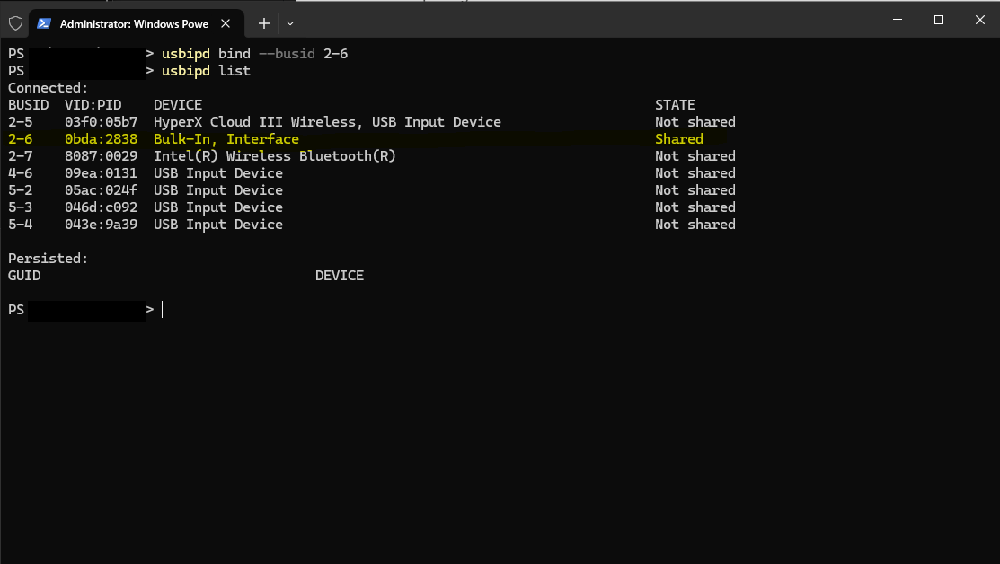
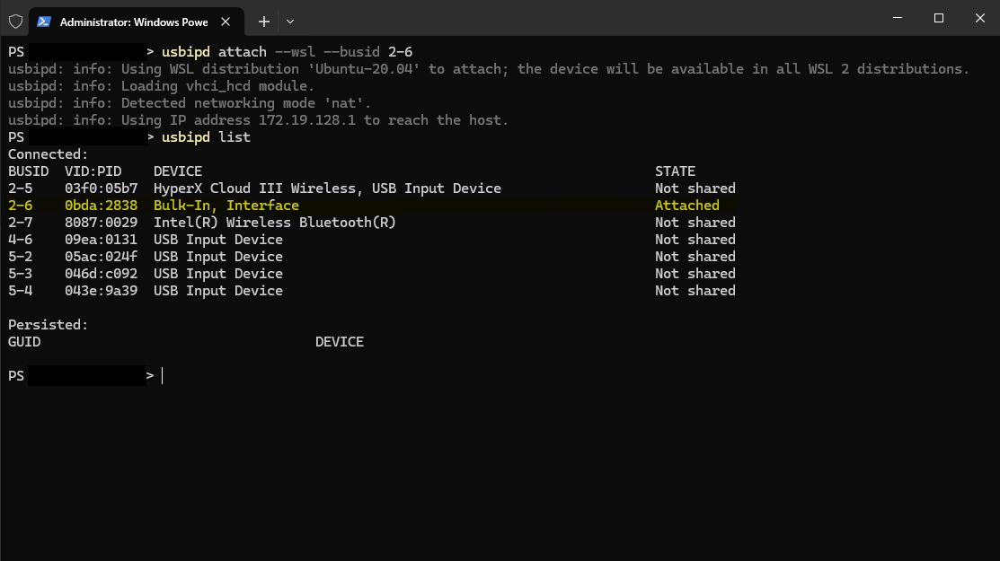
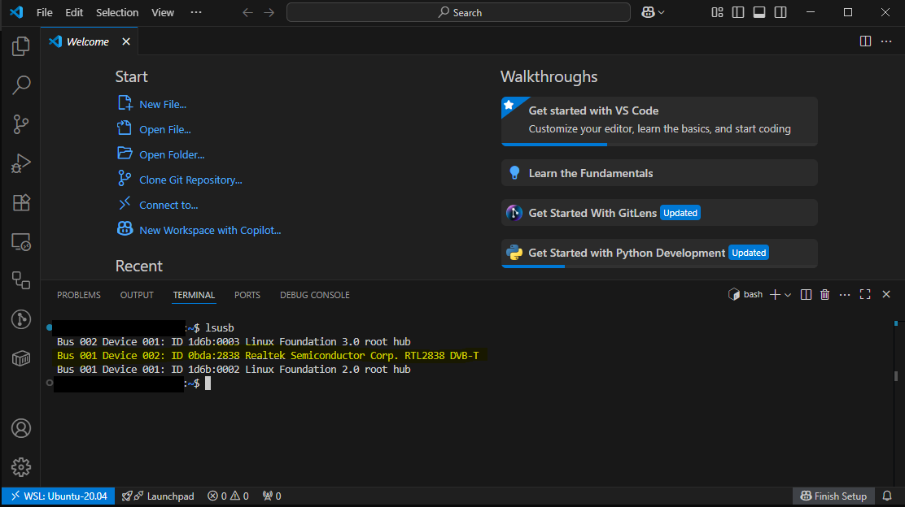
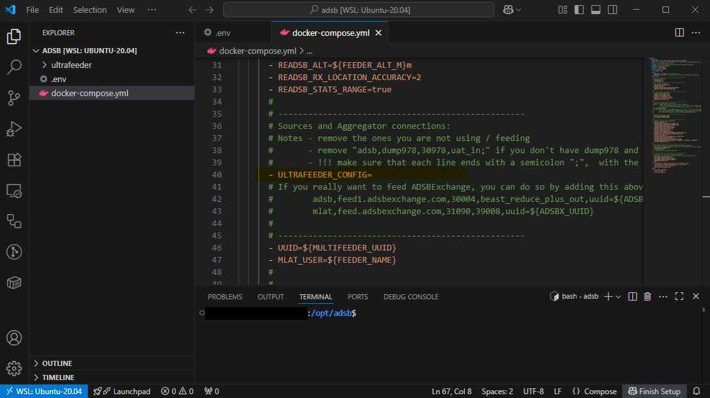
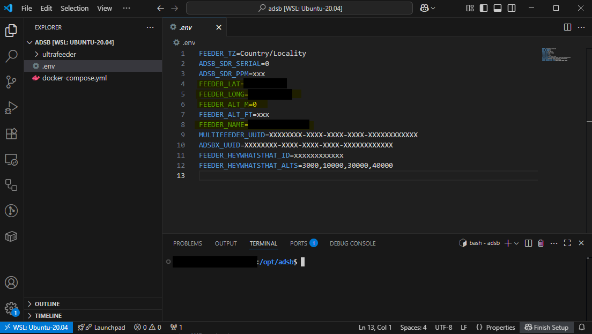
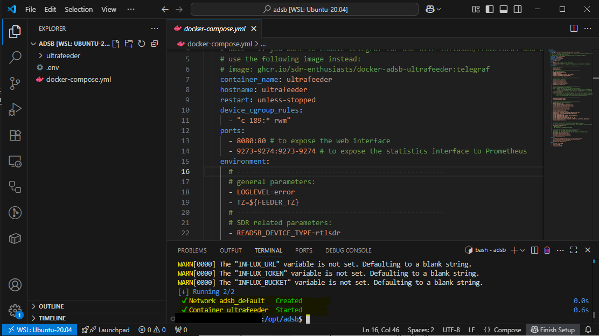

# Setting up an ADS-B antenna and SDR dongle on Windows + WSL

*For my Dad, who likes tinkering with his homelab and tools.*

*Happy birthday, Dad!*

## Background

[Automatic Dependent Surveillance-Broadcast (or ADS-B)][0_0] is an aviation
surveillance technology that nearly all aircraft are required, by law, to 
operate. ADS-B data is a standardized and openly transmitted format that
contains things like aircraft position and heading, allowing aircraft
to locate each other without line of sight, helping keep airspace safe.
Also, because ADS-B is openly transmitted, anyone can receive it, including
hobbyists on the ground. All one needs is an ADS-B antenna and a 
[software defined radio (SDR)][0_1] USB dongle, and they can receive, decode,
and monitor ADS-B data transmitted in their area. In fact, there's a huge
hobbyist community around collecting and publishing live ADS-B data to
[exchange sites][0_2]. Some folks have even made a [pretty penny][0_3] from
building business models around ADS-B data feeds.

[0_0]: https://en.wikipedia.org/wiki/Automatic_Dependent_Surveillance%E2%80%93Broadcast
[0_1]: https://en.wikipedia.org/wiki/Software-defined_radio
[0_2]: https://www.adsbexchange.com/
[0_3]: https://www.flightaware.com/news/article/Collins-Aerospace-to-acquire-FlightAware/1517

## Purpose

This is a quick guide on setting up an ADS-B antenna and SDR dongle on
Windows + [Windows Subsystem for Linux (WSL)][1_0] for folks that want
to track the aircraft in their area but are less familiar with the
hardware and software required to do so. In an idealized setup, a user
can purchase a [small, embedded Linux device][1_1] as a dedicated server
for running their ADS-B setup, but that can be overwhelming for folks
that aren't familiar with Linux.

[1_0]: https://learn.microsoft.com/en-us/windows/wsl/about
[1_1]: https://www.raspberrypi.com/

## Hardware

To start, you need an [ADS-B antenna][2_0], an [SDR dongle][2_1], and a
[coax cable][2_2] to connect the two. The linked ADS-B hardware setup 
can reach >200nm and costs ~$100. Ideally, when the hardware is setup,
the antenna should have clear line of sight to the sky and should be mounted
high in the air. Since the antenna and dongle will be connected to a
computer, you might want to get a long enough coax cable to place the antenna
in a good spot, or you might want to get a small, embedded Linux device
for your host machine and place it in a spot where a short coax cable would
benefit you the most. If that's too much effort, which is fine, this antenna
and dongle pair should still have decent enough range to capture a handful
of nearby aircraft even if the antenna is just sitting on the floor next to
your Windows machine.

[2_0]: https://a.co/d/90v9o3U
[2_1]: https://a.co/d/07ri77g
[2_2]: https://a.co/d/1w8GO0F

## Software

### Prerequisites and warning

This guide assumes you have administrative access to a Windows 10 or 11
host as you'll be required to install a few software packages. Some
of the software packages are niche and so there is a small risk that
they can be targeted [software supply chain attacks][3_0]. That being said:

- all the software is linked to and cited by ADS-B businesses and major
  software companies like Microsoft
- thousands of hobbyists run the same software

so the risk is probably negligible. If you're uncomfortable with that risk,
then you should probably buy a small, embedded Linux device to use as
your ADS-B tracking host machine. But, if you do that, then most of this
guide isn't applicable to you.

[3_0]: https://en.wikipedia.org/wiki/Supply_chain_attack

#### Windows host software prerequisites

Your Windows host needs the following:

- [WSL][4_0] for running [Docker][4_1] which helps run the ADS-B software
  for decoding and displaying ADS-B data
- [Docker Desktop][4_2] with [WSL support][4_3] for running Docker images
  that have ADS-B software packages and tools
- [USBIPD][4_4] for making the SDR dongle connected to your Windows host
  discoverable to WSL
- A code editor such as [VS Code][4_5] with the [WSL extension][4_6] for
  editing files in WSL

[4_0]: https://learn.microsoft.com/en-us/windows/wsl/install#install-wsl-command
[4_1]: https://docs.docker.com/get-started/docker-overview/
[4_2]: https://docs.docker.com/desktop/setup/install/windows-install/
[4_3]: https://docs.docker.com/desktop/features/wsl/#turn-on-docker-desktop-wsl-2
[4_4]: https://learn.microsoft.com/en-us/windows/wsl/connect-usb#install-usbipd-on-wsl
[4_5]: https://code.visualstudio.com/Download
[4_6]: https://code.visualstudio.com/docs/remote/wsl

### Installation

1. Follow the RTL-SDR Blog [quick start guide][5_0]. You're only
   required to follow up to and including step 12, but you can
   complete all the SDR# steps to test that your antenna and dongle
   are receiving and processing signals.

2. Run a PowerShell instance (or equivalent Windows shell) with admin
   privileges.

3. In the shell, list the USB devices connected to your Windows host using
   `usbipd list`.

   

   Note the bus ID that corresponds to your SDR dongle, which is likely
   to be named "Bulk-In, Interface".

4. Bind the SDR dongle using `usbipd bind` so the state can be shared with
   other systems.

   

5. Attach the SDR dongle to WSL using `usbipd attach`.

   

6. Open a VS Code editor instance.

7. In your VS Code editor, open a view to your WSL instance by pressing
   CTRL+SHIFT+P, searching for "WSL: Connect to WSL", and hitting ENTER.

8. Open an embedded terminal by pressing CTRL+` (backtick).

9. Install the `usbutils` package if it isn't already installed.

   ```bash
   sudo apt-get install -y usbutils
   ```

10. Verify that the SDR dongle is visible within WSL using `lsusb`.

   

11. Create an ADS-B directory and download the SDR Enthusiasts's configs
   for running ADS-B software.

   ```bash
   sudo mkdir -p -m 777 /opt/adsb
   cd /opt/adsb
   wget https://raw.githubusercontent.com/sdr-enthusiasts/docker-adsb-ultrafeeder/main/docker-compose.yml
   wget https://raw.githubusercontent.com/sdr-enthusiasts/docker-adsb-ultrafeeder/main/.env
   ```

12. Open the ADS-B directory in VS Code by pressing CTRL+SHIFT+P,
   searching for "WSL: Open Folder in WSL", hitting ENTER, typing in the
   path `/opt/adsb`, and hitting ENTER.

13. Open the Docker Compose file and edit the `ULTRAFEEDER_CONFIG` line
    to your preference. Personally, I leave it blank because I only
    want to view the aircraft that my own antenna can see.

    

14. Open the `.env` file and update the following highlighted fields.

    

    - `ADSB_SDR_SERIAL` should likely be 0, but may not be depending on the USB
    devices you have connected to WSL.
    - Set `FEEDER_LAT`, `FEEDER_LONG`, and `FEEDER_ALT_M` to your antenna's
    latitude, longitude, and altitude, respectively.
    - Set `FEEDER_NAME` to your desired feeder name. This'll be how your feed
    is broadcasted to exchanges (if you are broadcasting based on the 
    `ULTRAFEEDER_CONFIG` value), and how your feed is displayed in your
    aircraft tracking visualization tool.

15. Run the ADS-B software service.

    ```bash
    docker compose up -d
    ```

    You should see the service start up OK.

    

16. Open a browser, type in "localhost:8080" in the address bar, and hit ENTER.

17. DONE! You should be able to click around and explore the aircraft
    that're flying around in your area.

[5_0]: https://www.rtl-sdr.com/rtl-sdr-quick-start-guide/

### Post-installation

To run the ADS-B software service after you've already installed everything:

1. Run Docker Desktop on your Windows host.

1. Run the `Start-Ultrafeeder.ps1` PowerShell script found in this repo.

2. Open a browser, type in "localhost:8080" in the address bar, and hit ENTER.

3. You should be able to click around and explore the aircraft that're flying
   aroundin your area.

To stop the ADS-B software service, open Docker Desktop and stop the service.

## Other references

- This [*Weather Model based on ADS-B*][7_0] blog post is what inspired me to
  test this out and make this guide.
- There are many guides on linking USB devices to WSL, but seeing the
  flightradar24 forum user [bimmerdriver][7_1] test it out for their ADS-B
  feeder gave me more confidence that this would work before I committed.
- I tried a few different methods and tools for decoding ADS-B data, but the
  [SDR Enthusiasts's ADS-B Ultrafeeder Docker image][7_2] was definitely the
  simplest to setup and run.

[7_0]: https://obrhubr.org/adsb-weather-model
[7_1]: https://forum.flightradar24.com/forum/radar-forums/flightradar24-feeding-data-to-flightradar24/223806-how-to-set-up-a-feeder-on-windows-10-11-using-windows-subsystem-for-linux
[7_2]: https://github.com/sdr-enthusiasts/docker-adsb-ultrafeeder
